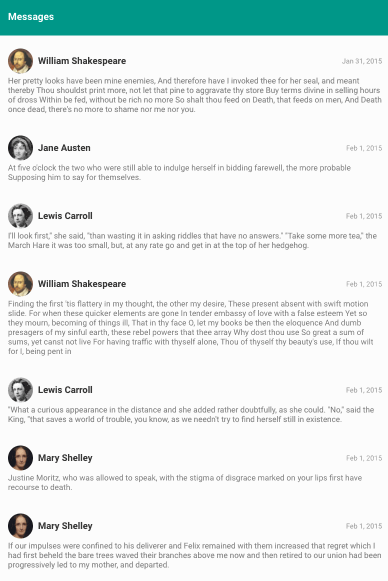

# messages-list
an infinitely scrolling list of messages with a fixed header, author information, message date, and content.

## introduction

a hosted version can be found [here](http://www.thekatielanier.com)

this messages app loads an almost infinite set of messages, organized chronologically.
while a lengthy list can often be problematic when it comes to performance, especially on a mobile device, i've implemented a windowed scrollable view (using angular material's virtual list) to cut down on the overhead of rendering hundreds or thousands of items at once.
this scrollable view renders a small sub-list of elements that are visible to the user (as well as a few on either side), to keep the scrolling experience light, while still feeling responsive.
new messages are loaded as needed, in ordered sets of 50 at a time - to allow for the best combination of speed, data availability, and flexibility.

i have included some responsive considerations, like hiding image elements on very small screens, to ensure the best experience for users across a wide range of devices.

## packages and components
for the app
* angular@1.6.2
* angular-material@1.1.4
* ui-router@1.0.0-beta.3
* underscore@1.8.3

for compilation and development
* gulp@3.9.1
* browser-sync@2.18.8
* eslint@3.15.0
* webpack@2.2.1

## setup and usage
* to initialize the app, first make sure you are running at least `node v8.4.0`.
* then, if you do not already have `gulp` and `gulp-cli` installed, you can do so with `npm install -g gulp gulp-cli`.
* once your environment is set up, you can build the app with `gulp` or `gulp serve`.
  * use `gulp` to run a one-off build, compiled into the `/dist` directory
  * if you prefer to serve the app through gulp, you can run `gulp serve`, which will serve the app on `localhost:3000` and start running `browsersync` to live-reload the app upon any changes

## design
the design of this app was kept deliberately simple, with the balance between white space and information density taken carefully into account. i decided to keep avatar images small enough to sit comfortably within the flow of the list (without drawing too much attention to themselves and away from the content), while still remaining large enough to be immediately recognizable.

when first designing this app, i began by trying to figure out a good standardized height for each message, that would also allow me to perform additional calculations as to how many messages to load on each request. during the implementation process, however, i realized that would require additional technical and visual constraints that seemed of little benefit, as none of these massages are long enough to overwhelm the visual of the list.

the design process was as follows:
* understanding: reading through every element of the design exercise, as well as the messages api, to best understand what information i would be working with and what the end goals are
* wireframing: i made some rough mockups on paper to lay out the relevant elements (in this case the pieces were simple: an image, a name, a date, and the content of the message)
* high fidelity design: while i would normally spend time in sketch, illustrator, or photoshop creating a high fidelity design, the look of this app was simple enough that i felt comfortable jumping directly into code. that also allowed me to more directly experience how the infinite scrolling would feel and look, as well as the responsive elements.
* prototypal implementation: the last step. in this case, this was combined with my usual development of a high or medium fidelity mockup.

while i was unable to fully flesh out the animated elements of this interface due to time constraints, i would have liked to add in an eased slide out when swiping messages to delete, as well as a graceful collapsing of the messages list. next time!
